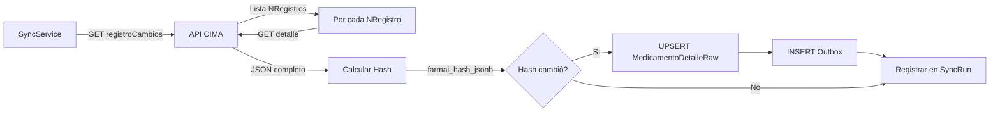
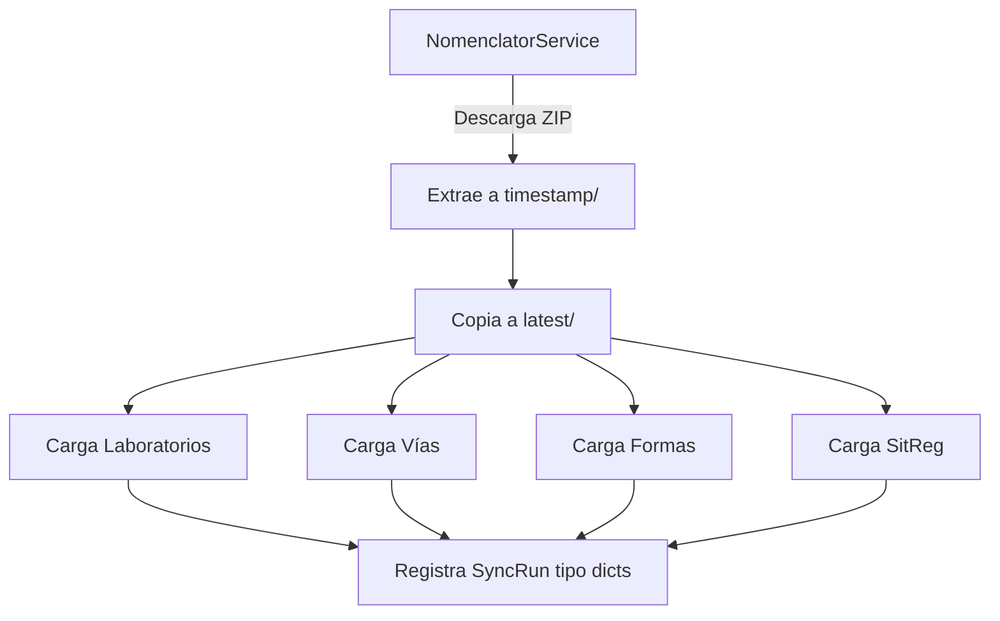

# 📚 FARMAI - Documentación de Investigación

> **ESTADO:** 🔍 MODO INVESTIGACIÓN - Análisis y Documentación en Proceso  
> **Última Actualización:** 10/01/2025  
> **Versión:** 1.0

---

## 📋 ÍNDICE

1. [Visión General](#1-visión-general)
2. [Arquitectura Tecnológica](#2-arquitectura-tecnológica)
3. [Estructura del Proyecto](#3-estructura-del-proyecto)
4. [Base de Datos PostgreSQL](#4-base-de-datos-postgresql)
5. [Flujos de Datos](#5-flujos-de-datos)
6. [Modelo de Grafo](#6-modelo-de-grafo)
7. [Conexiones Externas](#7-conexiones-externas)
8. [Características Técnicas](#8-características-técnicas)
9. [Roadmap y Futuro](#9-roadmap-y-futuro)
10. [Configuración](#10-configuración)
11. [Próximos Pasos](#11-próximos-pasos)

---

## 1. VISIÓN GENERAL

FARMAI es un **Sistema de Soporte a la Decisión Clínica Farmacéutica** que construye un **Grafo de Conocimiento Clínico** propietario basado en datos de la AEMPS (Agencia Española de Medicamentos y Productos Sanitarios).

### 🎯 Objetivo Principal
Identificar efectos adversos de medicamentos y proponer soluciones (farmacológicas, parafarmacia, consejos) priorizadas según evidencia y frecuencia.

### 💎 Ventaja Competitiva
Creación de una capa de inteligencia única: `Efecto Adverso` → `ES_ALIVIADO_POR` → `Producto/Remedio` que no existe en bases de datos oficiales.

### 🎯 Mercados Potenciales
- Farmacias Comunitarias
- Médicos de Atención Primaria/Especializada
- Hospitales
- Industria Farmacéutica (vía SaaS/API)

---

## 2. ARQUITECTURA TECNOLÓGICA

### 2.1 🛠️ Stack Principal

| Componente | Tecnología | Versión |
|------------|-----------|---------|
| **Backend** | ASP.NET Core | 8.0 |
| **Lenguaje** | C# | .NET 8 |
| **Base de Datos** | PostgreSQL | Local port 5433 |
| **ORM** | Entity Framework Core | 9.0.9 |
| **ETL** | Python | 3.11-slim |
| **Containerización** | Docker | Docker Compose |
| **IDE** | Visual Studio | 2022 |
| **Control de Versiones** | Git | GitHub |

### 2.2 🏗️ Componentes Principales

#### A) Farmai.Api (.NET 8 Web API)
API REST que gestiona:
- ✅ Sincronización con API CIMA de AEMPS
- ✅ Importación y enriquecimiento de datos de medicamentos
- ✅ Procesamiento de nomenclátor (archivos XML/ZIP)
- ✅ Gestión de diccionarios maestros
- ✅ Construcción del grafo de conocimiento

#### B) ETL Python
Scripts de procesamiento batch:
- `load_prescripcion_stream.py`: Carga masiva de XML de prescripción (streaming)
- `load_diccionarios.py`: Carga de catálogos (13 tipos diferentes)
- 23 scripts SQL para transformaciones y validaciones

---

## 3. ESTRUCTURA DEL PROYECTO

### 3.1 📁 Farmai.Api (Proyecto Principal)

```
Farmai.Api/
├── Controllers/          (5 controladores)
│   ├── CimaController.cs
│   ├── ImportController.cs
│   ├── MedicamentosController.cs
│   ├── SyncController.cs
│   └── WeatherForecastController.cs (template, a eliminar)
│
├── Services/            (8 servicios)
│   ├── CimaClient.cs
│   ├── ICimaClient.cs
│   ├── ImportService.cs
│   ├── SyncService.cs
│   ├── NomenclatorService.cs
│   ├── INomenclatorService.cs
│   ├── ZipOrXmlFetcher.cs
│   ├── IZipOrXmlFetcher.cs
│   └── HttpTextResponse.cs
│
├── Data/
│   ├── FarmaiDbContext.cs
│   ├── Entities/
│   │   ├── Medicamento.cs
│   │   └── MedicamentoDetalleStaging.cs
│   └── Migrations/
│       ├── 20250922123201_Init.cs
│       └── 20250922145020_AddMedicamentoCols.cs
│
├── Models/
│   └── Cima/
│       └── CimaMedicamentoDto.cs
│
└── Properties/
    └── launchSettings.json
```

### 3.2 🐍 ETL Python

```
etl/python/
├── Dockerfile
├── requirements.txt
├── load_prescripcion_stream.py
├── load_diccionarios.py
└── sql/                 (23 archivos SQL)
    ├── post_import_farmai.sql
    ├── dcpx_to_graph_v3.sql
    ├── pc_from_prescripcion.sql
    ├── create_indexes_all.sql
    └── ... (19 archivos más)
```

---

## 4. BASE DE DATOS POSTGRESQL

### 4.1 🗄️ Tablas Principales

#### **Medicamentos y Staging**
| Tabla | Descripción | PK |
|-------|-------------|-----|
| `Medicamentos` | Tabla central con datos básicos + RawJson (jsonb) | Id (Guid) |
| `MedicamentoDetalleStaging` | JSON detallado de cada medicamento | NRegistro |
| `MedicamentoDetalleRaw` | JSON raw con hash para detección de cambios | NRegistro |
| `PrescripcionStaging` | Staging de XML prescripción | CodNacion |
| `PrescripcionStaging_NUEVA` | Nueva versión de staging | CodNacion |

#### **Diccionarios/Catálogos (Staging)**
| Tabla | Contenido |
|-------|-----------|
| `LaboratoriosDicStaging` | Laboratorios (código, nombre, dirección, CIF) |
| `ViaAdministracionDicStaging` | Vías de administración |
| `FormaFarmaceuticaDicStaging` | Formas farmacéuticas |
| `FormaFarmaceuticaSimplificadaDicStaging` | Formas simplificadas |
| `SituacionRegistroDicStaging` | Situaciones de registro |
| `ExcipientesDeclObligDicStaging` | Excipientes de declaración obligatoria |
| `AtcXmlTemp` | Códigos ATC (con jerarquía) |
| `PrincipiosActivosXmlTemp` | Principios activos temporal |
| `PrincipiosActivos` | Principios activos final |
| `EnvaseDicStaging` | Tipos de envase |
| `UnidadContenidoDicStaging` | Unidades de contenido |
| `DcpDicStaging` | Denominación Común Española |
| `DcpfDicStaging` | DCP Farmacéutica |
| `DcsaDicStaging` | DCP Sustancia Activa |

#### **Relaciones N:M**
| Tabla | Relación |
|-------|----------|
| `MedicamentoVia` | Medicamento ↔ Vía Administración |
| `MedicamentoViaOverrides` | Overrides manuales de vías |
| `MedicamentoSustancia` | Medicamento ↔ Sustancia (con fuerza, unidad) |
| `MedicamentoPresentacion` | Medicamento ↔ Presentación (CN) |

#### **Presentaciones**
| Tabla | Descripción |
|-------|-------------|
| `Presentacion` | Código Nacional (CN) + Nombre |
| `PresentacionContenidoStaging` | Staging de contenido detallado |
| `PresentacionContenido` | Contenido final (envase, cantidad, unidad) |

#### **Grafo**
| Tabla | Descripción |
|-------|-------------|
| `graph_node` | Nodos (node_type, node_key, props jsonb) |
| `graph_edge` | Aristas (src_type, src_key, rel, dst_type, dst_key, props jsonb) |

#### **Control y Auditoría**
| Tabla | Propósito |
|-------|----------|
| `SyncRun` | Registro de ejecuciones (métricas completas) |
| `Outbox` | Cola de eventos transaccionales |
| `LaboratorioCodigoAemps` | Mapeo códigos AEMPS → LabId |
| `ViaAdministracionMap` | Mapeo IdCima ↔ IdPresc |

### 4.2 📊 Entidad Medicamento

#### **Campos Actuales**
```csharp
public class Medicamento
{
    public Guid Id { get; set; }
    public string NRegistro { get; set; }        // VARCHAR(32) UNIQUE
    public string Nombre { get; set; }           // VARCHAR(512)
    public string? LabTitular { get; set; }      // VARCHAR(256)
    public bool? Receta { get; set; }
    public bool? Generico { get; set; }
    public string? Dosis { get; set; }           // VARCHAR(128)
    public string RawJson { get; set; }          // JSONB
    public DateTime CreatedAt { get; set; }
    public DateTime UpdatedAt { get; set; }
}
```

#### **Campos Identificados como Necesarios** ⚠️
```sql
-- Foreign Keys
LaboratorioTitularId            INT
LaboratorioComercializadorId    INT

-- Flags Básicos
TrianguloNegro                  BOOLEAN
AfectaConduccion                BOOLEAN

-- Estado y Fechas
Comercializado                  BOOLEAN
FechaAutorizacion              TIMESTAMPTZ
FechaSuspension                TIMESTAMPTZ
FechaRevocacion                TIMESTAMPTZ

-- Flags Adicionales
Fotos                          BOOLEAN
MaterialesInformativos         BOOLEAN
Huerfano                       BOOLEAN
Biosimilar                     BOOLEAN
Psum                           BOOLEAN  -- Problema de Suministro

-- Enriquecimiento
RawJsonDetalle                 JSONB
EnrichedAt                     TIMESTAMPTZ
```

---

## 5. FLUJOS DE DATOS

### 5.1 🔄 Sincronización Diaria



**Características:**
- Fecha: `dd/MM/yyyy` (ayer por defecto)
- Detección de cambios: Hash SHA256 del JSON
- Idempotencia: ON CONFLICT por hash
- Métricas: ApiCalls, Found, Changed, DurationMs

### 5.2 📅 Sincronización Mensual

1. Descarga XML completo del nomenclátor
2. Extrae todos los NRegistros
3. Hidratación completa por API (reutiliza flujo diario)

### 5.3 ⚡ Backfill Medicamentos

```sql
-- Identifica faltantes
SELECT DISTINCT s."NRegistro"
FROM "PrescripcionStaging" s
LEFT JOIN "MedicamentoDetalleRaw" r ON r."NRegistro" = s."NRegistro"
WHERE r."NRegistro" IS NULL
```

**Características:**
- Procesamiento paralelo (maxParallel configurable)
- Delay entre llamadas (delayMs)
- Semaphore para control de concurrencia

### 5.4 📦 Procesamiento Nomenclátor



### 5.5 🐍 ETL Python

#### **Prescripción** (`load_prescripcion_stream.py`)
```python
# Streaming XML para eficiencia de memoria
for prescription in etree.iterparse(xml_path):
    # Extrae ~40 campos
    # UPSERT batch a PrescripcionStaging_NUEVA
    # Commits cada X registros (configurable)
```

**Campos extraídos:**
- CodNacion, NRegistro, CodDcp, CodDcpf, CodDcsa
- DesNomco, DesPrese, DesDosific
- Flags: Psicotropo, Estupefaciente, Conducción, TriánguloNegro
- Laboratorios, Fechas, Situación Registro

#### **Diccionarios** (`load_diccionarios.py`)

Soporta 13 tipos:
1. `laboratorios`: 6 campos (código, nombre, dirección, CP, localidad, CIF)
2. `vias`: Vías de administración
3. `forma`: Formas farmacéuticas (completas)
4. `forma_simpl`: Formas simplificadas
5. `sitreg`: Situaciones de registro
6. `atc`: Códigos ATC con jerarquía padre/hijo
7. `principios_activos`: Principios activos + ATC
8. `excipientes`: Excipientes de declaración obligatoria
9. `unidad_contenido`: Unidades de medida
10. `envases`: Tipos de envase
11. `dcp`: Denominación Común Española
12. `dcpf`: DCP Farmacéutica
13. `dcsa`: DCP Sustancia Activa

---

## 6. MODELO DE GRAFO

### 6.1 🔷 Nodos (Tipos Identificados)

| Node Type | Key | Props Example |
|-----------|-----|---------------|
| `Medicamento` | NRegistro | `{nombre: "..."}` |
| `Laboratorio` | Id | `{nombre: "...", cif: "..."}` |
| `ViaAdministracion` | Id | `{nombre: "Oral"}` |
| `Sustancia` / `PrincipioActivo` | Codigo | `{nombre: "Ibuprofeno"}` |
| `ATC` | Codigo | `{nombre: "...", nivel: 3}` |
| `DCP` / `DCPF` / `DCSA` | Codigo | `{nombre: "..."}` |
| `Presentacion` | CN | `{nombre: "..."}` |

### 6.2 🔗 Relaciones (Aristas)

```
Medicamento --[LAB_TITULAR]--> Laboratorio
Medicamento --[LAB_COMERCIALIZA]--> Laboratorio
Medicamento --[SE_ADMINISTRA_POR]--> ViaAdministracion
Medicamento --[CONTIENE {fuerza, unidad}]--> Sustancia
Medicamento --[PERTENECE_A_DCP/DCPF/DCSA]--> DCP/DCPF/DCSA
Medicamento --[TIENE_PRESENTACION]--> Presentacion
PrincipioActivo --[PERTENECE_A_ATC]--> ATC
ATC --[PADRE_DE]--> ATC  (jerarquía)
```

### 6.3 📑 Indexación del Grafo

```sql
CREATE INDEX idx_graph_edge_rel_src ON graph_edge (rel, src_type, src_key);
CREATE INDEX idx_graph_edge_rel_dst ON graph_edge (rel, dst_type, dst_key);
```

**Queries Típicas:**
```sql
-- Todos los medicamentos de un laboratorio
SELECT * FROM graph_edge 
WHERE rel = 'LAB_TITULAR' AND dst_key = '123';

-- Todas las vías de un medicamento
SELECT * FROM graph_edge 
WHERE rel = 'SE_ADMINISTRA_POR' AND src_key = '12345';
```

---

## 7. CONEXIONES EXTERNAS

### 7.1 🌐 API CIMA (AEMPS)

**Base URL:** `https://cima.aemps.es/cima/rest/`

#### Endpoints Implementados

| Endpoint | Método | Descripción |
|----------|--------|-------------|
| `maestras?maestra={id}` | GET | Catálogos (formas, vías, etc.) |
| `medicamentos?nombre={query}` | GET | Búsqueda por nombre |
| `medicamento?nregistro={nr}` | GET | Detalle completo JSON |
| `registroCambios?fecha=dd/MM/yyyy` | GET | Cambios desde fecha |

**URL Pública (no REST):**
- `https://cima.aemps.es/cima/publico/nomenclator/Prescripcion.xml`

#### Headers Configurados
```http
Accept: application/json
User-Agent: Farmai.Api/1.0 (+https://localhost)
```

#### Rate Limiting
- **Throttle:** 100ms delay entre llamadas
- **Razón:** Cívico, evitar sobrecarga del servidor público

### 7.2 📦 Archivos Externos

**Nomenclátor ZIP:**
- URL: `https://listadomedicamentos.aemps.gob.es/prescripcion.zip`
- Contenido: ~13 archivos XML (diccionarios + prescripción)

**Almacenamiento Local:**
```
bin/Debug/net8.0/_data/nomenclator/
├── 20250110_153045/         (timestamp)
│   ├── Prescripcion.xml
│   ├── DICCIONARIO_LABORATORIOS.xml
│   ├── DICCIONARIO_VIAS_ADMINISTRACION.xml
│   └── ... (11 archivos más)
└── latest/                  (symlink lógico)
    └── ... (mismos archivos)
```

---

## 8. CARACTERÍSTICAS TÉCNICAS

### 8.1 🔧 PostgreSQL Extensions

```sql
CREATE EXTENSION IF NOT EXISTS unaccent;  -- Normalización de texto
CREATE EXTENSION IF NOT EXISTS pg_trgm;   -- Búsqueda fuzzy
```

### 8.2 📊 Índices Optimizados

#### GIN Trigram (Búsqueda Fuzzy)
```sql
CREATE INDEX idx_medicamentos_nombre_trgm 
  ON "Medicamentos" USING gin ("Nombre" gin_trgm_ops);

CREATE INDEX idx_medicamentos_labtitular_trgm 
  ON "Medicamentos" USING gin ("LabTitular" gin_trgm_ops);
```

#### B-tree Standard
```sql
CREATE INDEX idx_presc_nregistro ON "PrescripcionStaging_NUEVA"("NRegistro");
CREATE INDEX idx_presc_lab_tit ON "PrescripcionStaging_NUEVA"("LabTitularCodigo");
```

#### Unique Constraints
```sql
CREATE UNIQUE INDEX ux_medicamentovia_nreg_via 
  ON "MedicamentoVia"("NRegistro","ViaId");
```

### 8.3 🎨 Patrones de Diseño

| Patrón | Implementación |
|--------|----------------|
| **Repository** | Implícito vía EF Core DbContext |
| **Service Layer** | Lógica de negocio separada de controllers |
| **DTO Pattern** | CimaMedicamentoDto para API responses |
| **Staging Pattern** | Tablas temporales antes de normalización |
| **Outbox Pattern** | Eventos transaccionales para procesamiento asíncrono |
| **Idempotencia** | ON CONFLICT en todos los UPSERTS |

### 8.4 🔐 Gestión de Cambios

#### Hash-based Change Detection
```sql
-- Función personalizada PostgreSQL
SELECT farmai_hash_jsonb(@json::jsonb);
-- Retorna: SHA256 del JSON ordenado canónicamente
```

#### Timestamps Automáticos
- `CreatedAt`: Primera inserción
- `UpdatedAt`: Última modificación
- `FetchedAt`: Última descarga desde API

#### Audit Trail
```sql
-- SyncRun registra métricas completas
{
  "Id": 123,
  "Kind": "daily",
  "StartedAt": "2025-01-10T15:30:00Z",
  "FinishedAt": "2025-01-10T15:45:23Z",
  "Ok": true,
  "ApiCalls": 450,
  "Found": 450,
  "Changed": 23,
  "Unchanged": 427,
  "DurationMs": 923456,
  "ErrorsJson": null
}
```

---

## 9. ROADMAP Y FUTURO

### 9.1 ✅ Fase Actual (Completado)

- [x] Ingesta básica CIMA API
- [x] Sincronización diaria/mensual/backfill
- [x] Procesamiento nomenclátor XML
- [x] Staging de 13 diccionarios
- [x] Grafo básico (Medicamento-Lab-Via)
- [x] Control de cambios con hash
- [x] Outbox pattern para eventos

### 9.2 ⏳ Siguientes Pasos (Roadmap Original)

#### **Fase 2: Normalización Completa**
1. [ ] Principios Activos (con fuerza/unidad)
2. [ ] Excipientes (con flag declaración obligatoria)
3. [ ] ATC completo (con jerarquía navegable)
4. [ ] Estados y fechas (comercialización, autorización, suspensión)
5. [ ] Alertas rápidas (conducción, triángulo, documentos, fotos)

#### **Fase 3: Capa de Inteligencia**
1. [ ] Extracción NLP de fichas técnicas:
   - Indicaciones (sección 4.1)
   - Posología (sección 4.2)
   - Contraindicaciones (sección 4.3)
   - Advertencias (sección 4.4)
   - Interacciones (sección 4.5)
   - Embarazo/Lactancia (sección 4.6)
   - Conducción (sección 4.7)
   - Reacciones adversas (sección 4.8)

2. [ ] Normalización SNOMED CT
3. [ ] Construcción de relaciones:
   - `Medicamento --[PROVOCA]--> EfectoAdverso`
   - `EfectoAdverso --[ES_ALIVIADO_POR]--> Remedio`
   - `Medicamento --[INTERACTUA_CON]--> Medicamento`

#### **Fase 4: Curación y Validación**
1. [ ] Herramienta web interna para expertos
2. [ ] Flujo de "Sugerencia y Validación"
3. [ ] Trazabilidad de evidencia (fragmentos de texto)
4. [ ] Cola de trabajo priorizada por score de confianza
5. [ ] Feedback loop para reentrenamiento

#### **Fase 5: MVP**
1. [ ] API REST de consultas complejas
2. [ ] Aplicación web piloto
3. [ ] Demos para clientes potenciales

### 9.3 🚀 Visión a Largo Plazo

#### **Escalado Cloud**
- [ ] Migración a Azure/AWS
- [ ] SaaS multi-tenant
- [ ] API Gateway con rate limiting
- [ ] Azure OpenAI Service para NLP

#### **Integraciones**
- [ ] Chatbots farmacéuticos
- [ ] TPV de farmacias (venta cruzada inteligente)
- [ ] Sistemas hospitalarios (CDSS)
- [ ] Apps móviles para profesionales

#### **Modelo de Negocio**
- [ ] Suscripción por farmacia
- [ ] Licencias hospitalarias
- [ ] API de consulta (pay-per-call)
- [ ] Consultoría y customización

---

## 10. CONFIGURACIÓN

### 10.1 🔌 Connection Strings

#### Development (appsettings.Development.json)
```json
{
  "ConnectionStrings": {
    "Postgres": "Host=localhost;Port=5433;Database=farmai_db;Username=farmai_user;Password=Iaforeverfree;Include Error Detail=true"
  }
}
```

### 10.2 👥 Usuarios de Base de Datos

| Usuario | Uso | Permisos |
|---------|-----|----------|
| `farmai_user` | API principal | SELECT, INSERT, UPDATE en todas las tablas |
| `farmai_etl_user` | ETL Python | SELECT, INSERT, UPDATE en staging + ejecutar funciones |

### 10.3 🐳 Docker Compose

```yaml
services:
  etl-prescripcion:
    build:
      context: ./etl/python
      dockerfile: Dockerfile
    volumes:
      - "C:/Users/Victor/Desktop/FARMAI/Farmai.Api/bin/Debug/net8.0/_data/nomenclator/latest:/data:ro"
    command: >
      --xml /data/Prescripcion.xml
      --dsn "host=host.docker.internal port=5433 dbname=farmai_db user=farmai_etl_user password=Iaforeverfree"
      --table PrescripcionStaging_NUEVO
      --batch 2000
```

### 10.4 🌐 Configuración API CIMA

```json
{
  "Cima": {
    "BaseUrl": "https://cima.aemps.es/cima/rest/",
    "RegistroCambiosPath": "registro?fecha={0}"
  }
}
```

---

## 11. PRÓXIMOS PASOS

### 📌 Fase de Investigación Actual

1. **COMPLETADO** ✅
   - Análisis completo de la aplicación
   - Documentación de arquitectura
   - Mapeo de tablas y relaciones
   - Identificación de flujos de datos

2. **SIGUIENTE: ESTUDIO DE BASE DE DATOS** 🔍
   - [ ] Conectar a PostgreSQL
   - [ ] Inspeccionar schema completo
   - [ ] Validar existencia de tablas documentadas
   - [ ] Identificar tablas no documentadas
   - [ ] Analizar datos reales (counts, ejemplos)
   - [ ] Validar integridad referencial
   - [ ] Revisar índices y constraints actuales

3. **DESPUÉS: NORMALIZACIÓN** 🔨
   - [ ] Implementar campos faltantes en Medicamento
   - [ ] Crear/actualizar tablas de relación
   - [ ] Poblar grafo completo
   - [ ] Validar consistencia de datos

---

## 📝 NOTAS DE INVESTIGACIÓN

### Archivos Clave Analizados

#### ✅ Configuración (4 archivos)
- `FARMAI.sln`
- `.gitignore`
- `docker-compose.yml`
- `## Roadmap del Proyecto v2.0 Sistem.txt`

#### ✅ API .NET (25 archivos)
- **Config:** `Farmai.Api.csproj`, `appsettings.json`, `appsettings.Development.json`, `Program.cs`
- **Controllers:** 5 archivos
- **Services:** 8 archivos
- **Data:** 2 entidades + 2 migraciones + DbContext
- **Models:** 1 DTO

#### ✅ ETL Python (5 archivos + 3 SQL)
- `Dockerfile`, `requirements.txt`
- `load_prescripcion_stream.py`
- `load_diccionarios.py`
- `post_import_farmai.sql`
- `dcpx_to_graph_v3.sql`
- `pc_from_prescripcion.sql`

### Archivos SQL Restantes (20)

**Pendientes de análisis detallado:**
- check_dcpx_links.sql
- check_dcpx.sql
- count_pc.sql
- count_presentaciones.sql
- create_indexes_all.sql
- create_indexes_dcpx_user.sql
- create_indexes_dcpx.sql
- dcpx_links.sql
- fill_missing_pc.sql
- fill_placeholder_pc_for_legacy.sql
- find_cn_for_missing_meds.sql
- find_missing_dcp.sql
- find_missing_dcpf.sql
- fix_missing_med_presentacion_edges.sql
- fix_missing_med_presentacion.sql
- graph_health_report.sql
- list_meds_sin_presentacion.sql
- pc_to_graph.sql
- reassign_graph_owners.sql
- sample_dcpx_with_names.sql

**Nota:** Estos archivos serán relevantes para:
- Validación de integridad
- Creación de índices completos
- Transformaciones de datos
- Reportes de salud del grafo

---

## 🔍 HALLAZGOS IMPORTANTES

### 1. Arquitectura Sólida
- ✅ Separación clara de responsabilidades
- ✅ Patrones de diseño bien implementados
- ✅ Idempotencia en todos los procesos
- ✅ Audit trail completo

### 2. Gestión de Datos Robusta
-
